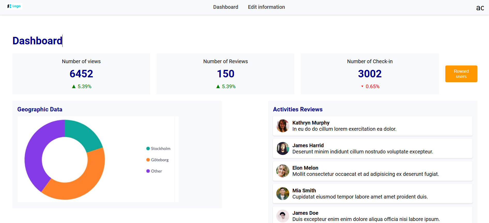

# Angular Dashboard Project

This is a simple dashboard application built using **Angular v17** and **Angular Material UI**. The dashboard features a placeholder pie chart (currently an image) which will be replaced with a real-time graph using a visualization library in a future update.

---

## Features

- **Dashboard Layout**: Clean and modern UI using Angular Material.
- **Pie Chart Placeholder**: Displays a static image for now (to be replaced with a real-time visualization).
- **Responsive Design**: Works seamlessly on desktop and mobile devices.

---

## Technologies Used

- **Angular v17**: Framework for building the application.
- **Angular Material**: For pre-built UI components.

---

## Project Setup

Follow the instructions below to set up and run the project locally.

### Prerequisites

- **Node.js** (v16 or higher)
- **Angular CLI** (v17 or higher)
- A code editor (e.g., VS Code)

### Installation Steps

1. Clone the repository:
   ```bash
   git clone <repository-url>
   ```

2. Navigate to the project folder:
   ```bash
   cd angular-dashboard
   ```

3. Install dependencies:
   ```bash
   npm install
   ```

4. Run the development server:
   ```bash
   ng serve
   ```

5. Open the application in your browser:
   ```
   http://localhost:4200
   ```

---

## Screenshot



> **Note**: Ensure the screenshot is placed in the `src/assets/` folder with the filename `screenshot.png`. Update the path if necessary.

---

## Future Enhancements

- Replace the static pie chart image with a real-time graph using a visualization library (e.g., Chart.js, D3.js, or ApexCharts).
- Add more widgets and data visualizations.
- Enhance the styling and animations.

---


## Contact

For any queries, feel free to reach out:

- **Name**: Anand Venkataraman  
- **Website**: [anandvenky.com](https://anandvenky.com)
